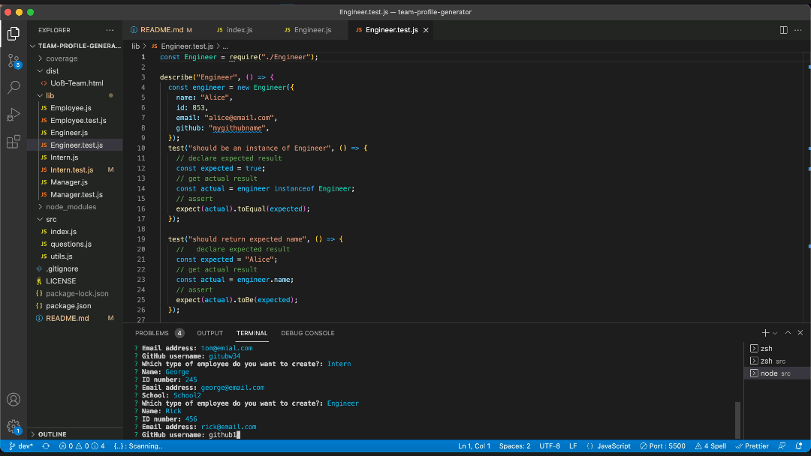

# Team Profile Generator 

## Table of Contents

- [Description](#description)
  - [Built With](#built-with)
- [Getting Started](#getting-started)
  - [Installation](#installation)
  - [Usage](#usage)
  - [Tests](#tests)
- [Contributing](#contributing)
- [License](#license)
- [Demo Video](#demo-video)

## Description

Node.js command-line application taking user input via the inquirer package and returning a styled "team profile" html page with individual member cards.

### Technologies

- Node.js
- Inquirer package
- Jest
- HTML
- Bootstrap

## Getting Started

### Installation

Run the following script to install the application:

```
git clone https://github.com/kayleriegerpatton/team-profile-generator.git
cd team-profile-generator
npm install
```

### Usage

Run the following script to use the application:

```
npm run start
```

### Tests

Run the following script to test the application:

```
npm run test
<!-- OR -->
npm run test:watch
```

## Contributing

To contribute to this project, please [email](mailto:kayle.patton22@gmail.com) me.

## License

MIT License

## Demo Video

View the [app demo video](https://drive.google.com/file/d/1cAm5uS1AbOoy8jIXAAhPEshkxHG2Q4zB/view?usp=sharing)


